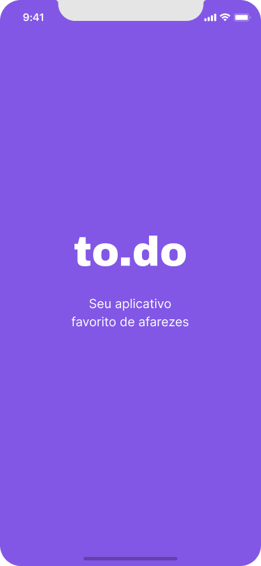

<div>
  
</div>

<div>
  
  
  
  
  
</div>

<br/>

## 📚 Informações sobre o projeto

- Esse projeto foi desenvolvido durante um desafio da rocketseat no Chapter-1 do Ignite, a plataforma Rocketseat disponibilizou o template no qual tinhamos que fazer as implementações de funcionalidade e correçào de codigo.

&nbsp;


## 💻 O que tem no projeto?

- No desafio tinhamos que corrigir o codigo ja existente e implementar funcionalidades, e passe nos testes.

- No segundo desafio tinhamos que implmentar a funcionalidade de editar o Todo e alerta ao tenta excluir.

## 💻 Documentação do desafio

- [Desafio 1 - Chapter 1 React Native](https://chip-dryosaurus-9ab.notion.site/Chapter-I-Desafio-01-Conceitos-do-React-Native-3697ba4f1d044385b72aaf7b28d21df0)


- [Desafio 2 - Chapter 1 React Native](https://chip-dryosaurus-9ab.notion.site/Chapter-I-Desafio-02-Adicionando-edi-o-e-alertas-7f9b47f77fab47bf8b7d86ed234a9e1c)

<br/>

## 🖼️ Template do projeto Figma

- [Template do projeto original para clone](https://www.figma.com/file/C8kqA20R9fShwo3gPLjT5G/to.do-(Copy)?node-id=10485%3A499)

<br/>   

## 🛠️ Tecnologias/Ferramentas ultilizadas

- [React](https://pt-br.reactjs.org/E)
- [React-native](https://vitejs.dev/)
- [TypeScript](https://www.typescriptlang.org/)
- [Jest](https://testing-library.com/docs/)

## ⚙️ Instalação

```
# Abra um terminal e copie este repositório com o comando
$ git clone https://github.com/Hugovarellaa/ignite-template-react-native-todos
```

```
# Acesse a pasta da aplicação
$ cd ignite-template-react-native-todos

# Instale as dependências
$ yarn

# Inicie o Metro bundler
$ yarn start 

# Depois do emulador aberto
$ yarn android 


```

---

<p align="center">Feito com 💙 por Hugo Alves Varella</p>